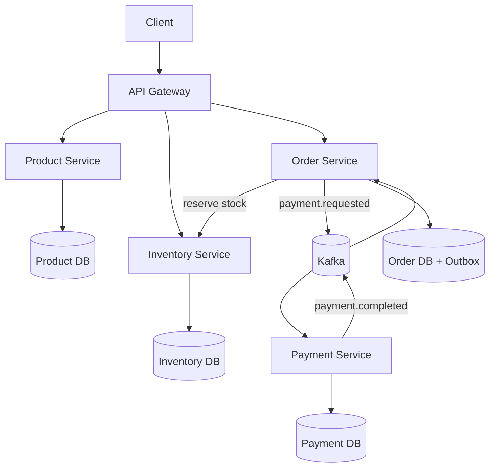
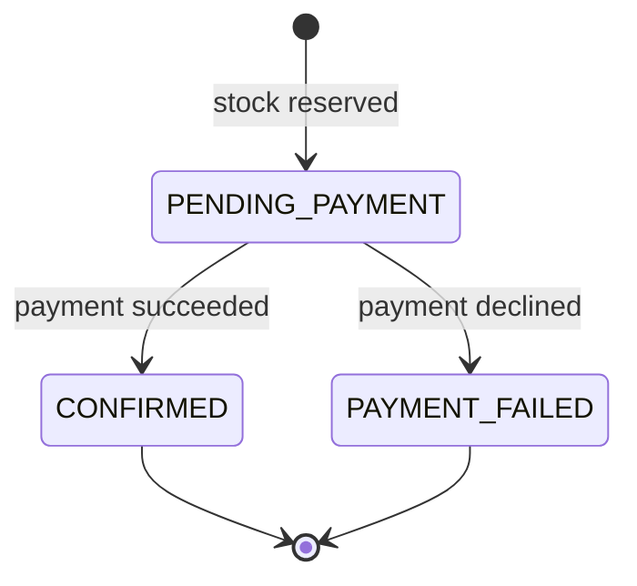

<div align="center">

# Cloud Commerce Platform

**A production-style Java microservices and DevOps portfolio project**


[](https://github.com/therealilyas/cloud-commerce-platform/actions/workflows/ci.yml)
[](https://github.com/therealilyas/cloud-commerce-platform/actions/workflows/security.yml)


From REST request to asynchronous payment, observable deployment, and GitOps-ready Kubernetes manifests.

</div>

## Why this project exists

Most portfolio applications stop at CRUD. This project demonstrates the engineering decisions behind a service that must remain understandable when the database, message broker, or another service is slow or unavailable.

It is intentionally small enough to run in a homelab, but includes patterns discussed in mid/senior Java and DevOps interviews:

- Database-per-service boundaries
- Event-driven order/payment workflow
- Transactional outbox on the order side
- Idempotent order and payment processing
- Pessimistic locking for stock reservation
- Health probes and Prometheus metrics
- Reproducible Docker and Helm deployments
- CI, image releases, dependency updates, and GitOps manifests

## Architecture



### Order lifecycle



## Service map

| Service | Port | Responsibility | Storage |
|---|---:|---|---|
| API Gateway | 8080 | Single public entry point and routing | — |
| Product Service | 8081 | Product catalog | PostgreSQL |
| Inventory Service | 8082 | Stock and idempotent reservations | PostgreSQL |
| Order Service | 8083 | Order workflow and transactional outbox | PostgreSQL |
| Payment Service | 8084 | Idempotent simulated payment processing | PostgreSQL |

Prometheus runs on `9090`, Grafana on `3000`, and Redpanda exposes Kafka locally on `19092`.

## Quick start

### Requirements

- Docker Engine 25+ with Compose v2
- 6 GB free RAM recommended
- `curl` for the smoke test

### Run everything

```bash
git clone https://github.com/therealilyas/cloud-commerce-platform.git
cd cloud-commerce-platform
cp .env.example .env
docker compose up --build -d
docker compose ps
```

Wait until the application containers report `healthy`, then run:

```bash
chmod +x scripts/smoke-test.sh
./scripts/smoke-test.sh
```

Open:

- Gateway health: http://localhost:8080/actuator/health
- Prometheus: http://localhost:9090
- Grafana: http://localhost:3000 (`admin` / `admin`; change it outside local development)

Stop and remove local data:

```bash
docker compose down -v
```

## API examples

Create a product:

```bash
curl -X POST http://localhost:8080/api/products \
  -H 'Content-Type: application/json' \
  -d '{
    "sku": "LAPTOP-001",
    "name": "Developer Laptop",
    "description": "A sample catalog item",
    "price": 1299.00
  }'
```

Add stock using the returned product ID:

```bash
curl -X POST http://localhost:8080/api/inventory/PRODUCT_ID/stock \
  -H 'Content-Type: application/json' \
  -d '{"quantity": 25}'
```

Create an order:

```bash
curl -X POST http://localhost:8080/api/orders \
  -H 'Content-Type: application/json' \
  -H 'Idempotency-Key: customer-42-checkout-001' \
  -d '{
    "customerId": "00000000-0000-0000-0000-000000000042",
    "productId": "PRODUCT_ID",
    "quantity": 1,
    "unitPrice": 1299.00
  }'
```

The initial response is `PENDING_PAYMENT`. Query the returned order ID after a moment; it becomes `CONFIRMED` or `PAYMENT_FAILED`.

## Reliability patterns

| Risk | Current control | Why it matters |
|---|---|---|
| Client retries create duplicate orders | Unique `Idempotency-Key` | Same request returns the existing order |
| Two buyers reserve the last item | Database row lock | Prevents overselling in this consistency model |
| Order commits but Kafka is unavailable | Transactional outbox | Event remains durable and is retried |
| Kafka redelivers payment request | Unique payment per order | Payment processing is idempotent |
| Consumer receives duplicate result | State transition guard | Confirmed/failed orders are not mutated twice |
| Container is alive but unusable | Readiness/liveness probes | Kubernetes routes only to ready pods |

See [Architecture](docs/ARCHITECTURE.md) for boundaries and trade-offs.

## Learn and evaluate the project

- [0-to-complete hands-on guide in Uzbek](docs/ZERO_TO_COMPLETE_GUIDE_UZ.md)
- [Senior Java Engineer readiness assessment](docs/SENIOR_JAVA_READINESS.md)
- [Operations runbook](docs/RUNBOOK.md)
- [Implementation roadmap](ROADMAP.md)

## Local development

Use Java 21. The repository contains a lightweight Maven bootstrap script, so a global Maven installation is optional.

```bash
chmod +x mvnw
./mvnw clean verify
```

Run infrastructure in Docker, then start one service from the IDE or terminal:

```bash
docker compose up -d product-db inventory-db order-db payment-db redpanda
./mvnw -pl product-service spring-boot:run
```

Default database ports are `5433`–`5436`. Configuration is externalized with environment variables; `.env` is ignored by Git.

## Kubernetes and GitOps

The Helm chart expects external PostgreSQL and Kafka endpoints. Copy the example secret, replace every placeholder, and keep real secrets outside Git—prefer SOPS, External Secrets Operator, or Vault.

```bash
kubectl create namespace commerce
kubectl apply -n commerce -f deploy/helm/cloud-commerce/secrets.example.yaml
helm upgrade --install cloud-commerce deploy/helm/cloud-commerce \
  --namespace commerce \
  --set global.imageRegistry=ghcr.io/therealilyas \
  --set global.imageTag=0.1.0
```

For GitOps, update the repository URL in `deploy/argocd/application.yaml` and apply it to Argo CD.

## CI/CD

- Pull requests run the Maven verification suite and Helm lint.
- Tags such as `v0.1.0` build five OCI images and publish them to GHCR.
- Dependabot groups Spring updates and checks GitHub Actions monthly.
- Images run as a non-root user; Kubernetes drops Linux capabilities and enables a read-only root filesystem.

## Observability

Every service exposes:

- `/actuator/health/liveness`
- `/actuator/health/readiness`
- `/actuator/prometheus`

Prometheus automatically scrapes all five applications in Docker Compose. Grafana is provisioned with the Prometheus data source. The next milestone adds OpenTelemetry traces, Loki logs, SLO dashboards, and alert routing.

## Repository layout

```text
.
├── api-gateway/
├── product-service/
├── inventory-service/
├── order-service/
├── payment-service/
├── shared-kernel/
├── deploy/
│   ├── argocd/
│   └── helm/
├── observability/
├── scripts/
├── docs/
├── .github/workflows/
└── docker-compose.yml
```

## Deliberate limitations

This is an honest portfolio project, not a claim of finished enterprise software.

- Payment is simulated; no real money or card data is handled.
- Authentication/authorization is planned with Keycloak/OIDC.
- Inventory release after a failed payment is the next Saga compensation step.
- Multi-item orders, tax, delivery, and product price lookup are intentionally deferred.
- Outbox delivery is at-least-once; consumers must remain idempotent.
- Production secrets, TLS, backup/restore, and multi-zone databases belong to the target platform.

See [ROADMAP.md](ROADMAP.md) for the staged plan.

## Interview talking points

If you use this project in an interview, be ready to explain:

1. Why database-per-service avoids shared-schema coupling.
2. Why the outbox solves one half of the database/Kafka dual-write problem.
3. Why exactly-once business outcomes still require idempotent consumers.
4. When pessimistic locking is preferable to optimistic retries.
5. How readiness differs from liveness.
6. How you would measure SLOs, RPO, and RTO in a homelab.

## Contributing and security

Read [CONTRIBUTING.md](CONTRIBUTING.md) before opening a pull request. Please report vulnerabilities according to [SECURITY.md](SECURITY.md), not through a public issue.

## License

MIT © 2026 Ilyas Sultan
