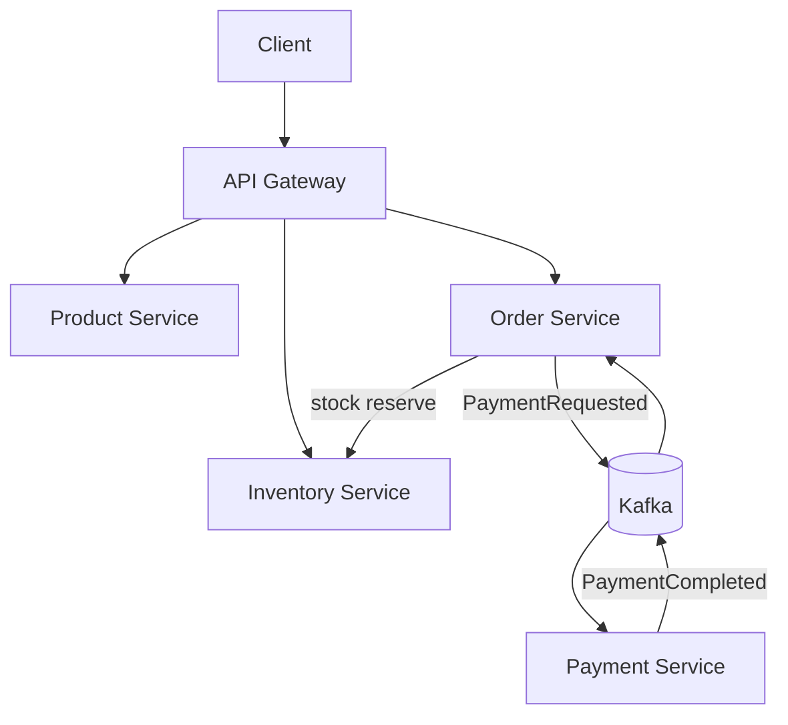
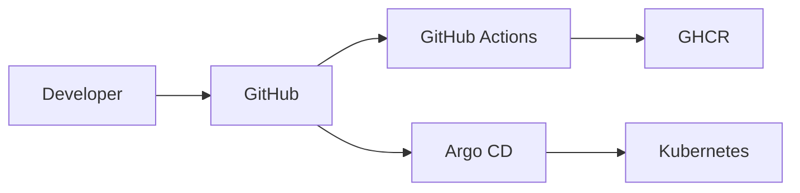

# Cloud Commerce Platform: 0 dan Complete gacha

Bu qo‘llanma loyihani shunchaki ishga tushirish uchun emas. Maqsad — har bir qism nima uchun mavjudligini tushunish, nosozliklarni ataylab hosil qilish, ularni diagnostika qilish va Java/DevOps interview’da qarorlarni himoya qila olish.

> Muhim: repository’ni clone qilib, `docker compose up` qilish sizni Senior qilmaydi. Senior daraja — kodni tushunish, trade-off’larni tushuntirish, incident’ni topish va tizimni xavfsiz o‘zgartira olishdir.

## 1. Yakunda nimalarni qila olasiz?

Qo‘llanmani tugatgach siz:

- Java 21 va Spring Boot multi-module project’ni build qilasiz;
- Product, Inventory, Order, Payment va Gateway servislarini tushuntirasiz;
- PostgreSQL database-per-service yondashuvini ko‘rsatasiz;
- Kafka event flow va transactional outbox’ni tushuntirasiz;
- idempotency va stock locking’ni test qilasiz;
- Docker Compose orqali to‘liq stack’ni ishga tushirasiz;
- Prometheus va Grafana’da metrics ko‘rasiz;
- Helm chart’ni tekshirib, Kubernetes’ga deploy qilasiz;
- GitHub Actions build va security pipeline’ini o‘qiysiz;
- ataylab failure yaratib, recovery qilasiz;
- Senior Java interview uchun project demo tayyorlaysiz.

## 2. Arxitektura — juda sodda tushuntirish



Oddiy misol:

1. Client order yuboradi.
2. Order Service omborda mahsulot borligini tekshiradi va band qiladi.
3. Order database’ga yoziladi.
4. Payment request avval outbox jadvaliga yoziladi.
5. Outbox publisher event’ni Kafka’ga yuboradi.
6. Payment Service to‘lovni simulyatsiya qiladi.
7. Natija Kafka orqali Order Service’ga qaytadi.
8. Order `CONFIRMED` yoki `PAYMENT_FAILED` bo‘ladi.

## 3. Kerakli resurslar

Minimal:

- 4 CPU thread;
- 8 GB RAM, 6 GB bo‘sh RAM tavsiya qilinadi;
- 10 GB bo‘sh disk;
- Git;
- Java 21;
- Docker Engine va Docker Compose v2;
- `curl` va `jq`.

Kubernetes bosqichi uchun qo‘shimcha:

- `kubectl`;
- Helm 3;
- K3s, kind yoki boshqa Kubernetes cluster;
- tashqi PostgreSQL va Kafka/Redpanda endpoint’lari.

## 4. CachyOS / Arch Linux tayyorlash

### 4.1 Paketlarni o‘rnating

```bash
sudo pacman -Syu
sudo pacman -S jdk21-openjdk git docker docker-compose curl jq
```

Docker’ni yoqing:

```bash
sudo systemctl enable --now docker
sudo usermod -aG docker "$USER"
```

Group o‘zgarishi kuchga kirishi uchun logout/login qiling. Keyin:

```bash
java -version
git --version
docker --version
docker compose version
curl --version
jq --version
```

Java natijasida `21` ko‘rinishi kerak.

### 4.2 Ubuntu Server varianti

```bash
sudo apt update
sudo apt install -y openjdk-21-jdk git docker.io docker-compose-v2 curl jq
sudo systemctl enable --now docker
sudo usermod -aG docker "$USER"
```

## 5. Project’ni clone qilish

```bash
git clone https://github.com/therealilyas/cloud-commerce-platform.git
cd cloud-commerce-platform
git status
```

Kutiladigan natija:

```text
On branch main
nothing to commit, working tree clean
```

Project ichidagi asosiy papkalar:

| Papka | Vazifa |
|---|---|
| `api-gateway` | Bitta tashqi kirish nuqtasi |
| `product-service` | Mahsulot katalogi |
| `inventory-service` | Stock va reservation |
| `order-service` | Order workflow va outbox |
| `payment-service` | Payment simulyatsiyasi |
| `shared-kernel` | Kafka event contract’lari |
| `observability` | Prometheus/Grafana konfiguratsiyasi |
| `deploy/helm` | Kubernetes Helm chart |
| `deploy/argocd` | GitOps Application manifest |
| `.github/workflows` | CI va security pipeline |

## 6. Kodni Docker’siz build qilish

Repository ichidagi `mvnw` kerakli Maven versiyasini yuklaydi.

```bash
chmod +x mvnw
./mvnw -B -ntp clean verify
```

`BUILD SUCCESS` chiqishi kerak.

Faqat bitta modul:

```bash
./mvnw -B -ntp -pl product-service -am test
```

Bu yerda:

- `-pl product-service` — shu modulni tanlaydi;
- `-am` — unga kerakli boshqa modullarni ham build qiladi;
- `test` — testlarni ishlatadi.

## 7. Birinchi to‘liq ishga tushirish

Environment faylini yarating:

```bash
cp .env.example .env
```

Birinchi demo doim muvaffaqiyatli payment qaytarishi uchun `.env` ichida:

```text
PAYMENT_SUCCESS_RATE=1.0
```

Stack’ni ko‘taring:

```bash
docker compose up --build -d
```

Birinchi build internet va kompyuter tezligiga qarab 5–20 daqiqa davom etishi mumkin.

Status:

```bash
docker compose ps
```

Application container’lari `healthy` bo‘lishi kerak. Agar hali `starting` bo‘lsa:

```bash
docker compose logs -f --tail=100
```

Log’dan chiqish: `Ctrl+C`.

## 8. Automated smoke test

```bash
chmod +x scripts/smoke-test.sh
./scripts/smoke-test.sh
```

Script quyidagilarni qiladi:

1. product yaratadi;
2. stock qo‘shadi;
3. order yaratadi;
4. product va order JSON’ini chiqaradi.

## 9. Manual business flow

### 9.1 Product yarating

```bash
PRODUCT_JSON=$(curl -fsS -X POST http://localhost:8080/api/products \
  -H 'Content-Type: application/json' \
  -d "{\"sku\":\"LAPTOP-$(date +%s)\",\"name\":\"Developer Laptop\",\"description\":\"Manual demo product\",\"price\":1299.00}")

echo "$PRODUCT_JSON" | jq
PRODUCT_ID=$(echo "$PRODUCT_JSON" | jq -r '.id')
echo "$PRODUCT_ID"
```

### 9.2 Stock qo‘shing

```bash
curl -fsS -X POST "http://localhost:8080/api/inventory/$PRODUCT_ID/stock" \
  -H 'Content-Type: application/json' \
  -d '{"quantity":10}' | jq
```

### 9.3 Order yarating

```bash
IDEMPOTENCY_KEY="manual-order-$(date +%s)"

ORDER_JSON=$(curl -fsS -X POST http://localhost:8080/api/orders \
  -H 'Content-Type: application/json' \
  -H "Idempotency-Key: $IDEMPOTENCY_KEY" \
  -d "{\"customerId\":\"00000000-0000-0000-0000-000000000042\",\"productId\":\"$PRODUCT_ID\",\"quantity\":1,\"unitPrice\":1299.00}")

echo "$ORDER_JSON" | jq
ORDER_ID=$(echo "$ORDER_JSON" | jq -r '.id')
```

Initial status odatda:

```text
PENDING_PAYMENT
```

Bir necha soniyadan keyin:

```bash
sleep 3
curl -fsS "http://localhost:8080/api/orders/$ORDER_ID" | jq
```

Kutiladigan status:

```text
CONFIRMED
```

## 10. Har bir service’ni tushunish

### 10.1 API Gateway

Fayl:

```text
api-gateway/src/main/resources/application.yml
```

Vazifasi:

- `/api/products/**` → Product Service;
- `/api/inventory/**` → Inventory Service;
- `/api/orders/**` → Order Service.

Interview savoli: “Nega business logic gateway’da emas?”

Javob: gateway routing, authentication, rate limiting va cross-cutting concern’lar uchun. Domain logic o‘z service’ida qolishi coupling’ni kamaytiradi.

### 10.2 Product Service

Muhim fayllar:

- `Product.java` — JPA entity;
- `ProductRepository.java` — database access;
- `ProductController.java` — REST API;
- `V1__create_products.sql` — Flyway migration.

Tekshirish:

```bash
curl -fsS http://localhost:8080/api/products | jq
```

### 10.3 Inventory Service

Muhim g‘oyalar:

- stock soni manfiy bo‘la olmaydi;
- reservation `orderId` orqali idempotent;
- pessimistic database lock parallel reservation’da overselling’ni oldini oladi.

Muhim kod:

```java
@Lock(LockModeType.PESSIMISTIC_WRITE)
```

Trade-off: lock correctness beradi, lekin juda katta trafikda contention yaratishi mumkin.

### 10.4 Order Service

Vazifalari:

- order yaratish;
- stock reserve qilish;
- idempotency key tekshirish;
- payment event’ni outbox’da saqlash;
- payment natijasiga ko‘ra statusni o‘zgartirish.

Nega outbox kerak?

Database commit bo‘lib, Kafka publish ishlamay qolishi mumkin. Order va event bir transaction’da database’ga yozilsa, event yo‘qolmaydi. Publisher keyinroq qayta urinadi.

### 10.5 Payment Service

Vazifalari:

- `PaymentRequested` event’ni olish;
- to‘lovni simulyatsiya qilish;
- bir order uchun duplicate payment yaratmaslik;
- `PaymentCompleted` event yuborish.

Bu real payment gateway emas. Hech qachon haqiqiy card ma’lumotini bu demo’ga yubormang.

## 11. Database’larni ichidan ko‘rish

Order’lar:

```bash
docker compose exec order-db \
  psql -U commerce -d orders \
  -c 'SELECT id, status, total, created_at FROM orders ORDER BY created_at DESC LIMIT 10;'
```

Outbox:

```bash
docker compose exec order-db \
  psql -U commerce -d orders \
  -c 'SELECT id, event_type, created_at, published_at FROM outbox_events ORDER BY created_at DESC LIMIT 10;'
```

Payment:

```bash
docker compose exec payment-db \
  psql -U commerce -d payments \
  -c 'SELECT order_id, status, amount, created_at FROM payments ORDER BY created_at DESC LIMIT 10;'
```

Stock:

```bash
docker compose exec inventory-db \
  psql -U commerce -d inventory \
  -c 'SELECT * FROM inventory;'
```

## 12. Kafka / Redpanda’ni ko‘rish

Topic ro‘yxati:

```bash
docker compose exec redpanda rpk topic list
```

Payment request event’lari:

```bash
docker compose exec redpanda \
  rpk topic consume payment.requested --num 5
```

Payment result event’lari:

```bash
docker compose exec redpanda \
  rpk topic consume payment.completed --num 5
```

Consumer group’lar:

```bash
docker compose exec redpanda rpk group list
```

## 13. Observability

URL’lar:

- Gateway health: <http://localhost:8080/actuator/health>
- Prometheus: <http://localhost:9090>
- Grafana: <http://localhost:3000>

Local Grafana login:

```text
username: admin
password: admin
```

Faqat local demo uchun. Production’da default password ishlatmang.

Prometheus’da sinab ko‘ring:

```promql
up{job="commerce-services"}
```

Request rate:

```promql
sum by (application) (rate(http_server_requests_seconds_count[5m]))
```

JVM heap:

```promql
sum by (application) (jvm_memory_used_bytes{area="heap"})
```

## 14. Failure Lab 1 — idempotency

Bir xil `Idempotency-Key` bilan aynan bir request’ni ikki marta yuboring:

```bash
KEY="same-checkout-001"

for i in 1 2; do
  curl -fsS -X POST http://localhost:8080/api/orders \
    -H 'Content-Type: application/json' \
    -H "Idempotency-Key: $KEY" \
    -d "{\"customerId\":\"00000000-0000-0000-0000-000000000042\",\"productId\":\"$PRODUCT_ID\",\"quantity\":1,\"unitPrice\":1299.00}" | jq -r '.id'
done
```

Ikkala javobda bir xil order ID chiqishi kerak.

Interview xulosasi: HTTP retry duplicate business operation yaratmasligi kerak.

## 15. Failure Lab 2 — insufficient stock

Mavjud stock’dan katta quantity yuboring:

```bash
curl -i -X POST http://localhost:8080/api/orders \
  -H 'Content-Type: application/json' \
  -H "Idempotency-Key: too-much-$(date +%s)" \
  -d "{\"customerId\":\"00000000-0000-0000-0000-000000000042\",\"productId\":\"$PRODUCT_ID\",\"quantity\":9999,\"unitPrice\":1299.00}"
```

`409 Conflict` kutiladi.

## 16. Failure Lab 3 — payment failure

`.env` ichida:

```text
PAYMENT_SUCCESS_RATE=0.0
```

Payment Service’ni qayta yarating:

```bash
docker compose up -d --force-recreate payment-service
```

Yangi order yarating va statusni tekshiring. `PAYMENT_FAILED` chiqishi kerak.

Muhim topilma: hozirgi MVP’da failed payment’dan keyin inventory avtomatik release qilinmaydi. Bu Saga compensation uchun keyingi P0 vazifa.

## 17. Failure Lab 4 — Kafka outage

Kafka’ni to‘xtating:

```bash
docker compose stop redpanda
```

Order Service log’ini kuzating:

```bash
docker compose logs -f --tail=100 order-service
```

Outbox jadvalida `published_at IS NULL` event qolishi mumkin:

```bash
docker compose exec order-db \
  psql -U commerce -d orders \
  -c 'SELECT id, event_type, published_at FROM outbox_events WHERE published_at IS NULL;'
```

Kafka’ni qaytaring:

```bash
docker compose start redpanda
```

Publisher qayta urinib event’ni yuborishi kerak. Shu holat transactional outbox’ning amaliy qiymatini ko‘rsatadi.

## 18. Failure Lab 5 — container recovery

Payment Service’ni o‘chiring:

```bash
docker compose kill payment-service
docker compose ps
```

Compose’dagi `restart: unless-stopped` sabab container qayta ko‘tarilishini tekshiring:

```bash
docker compose ps payment-service
docker compose logs --tail=50 payment-service
```

Kubernetes’da shu vazifani Deployment controller bajaradi.

## 19. Bitta service’ni IDE yoki terminaldan run qilish

Infrastructure’ni ko‘taring:

```bash
docker compose up -d product-db inventory-db order-db payment-db redpanda
```

Compose’dagi mos application container’ni to‘xtating, aks holda port band bo‘ladi:

```bash
docker compose stop product-service gateway
```

Product Service:

```bash
./mvnw -pl product-service spring-boot:run
```

Boshqa terminalda test:

```bash
curl -fsS http://localhost:8081/api/products | jq
```

## 20. Test strategiyasi

Hozirgi testlarni run qilish:

```bash
./mvnw clean verify
```

Senior-ready holat uchun test pyramid:

1. Unit test — domain calculation va state transition;
2. Slice test — controller/repository;
3. Integration test — Testcontainers PostgreSQL va Kafka;
4. Contract test — service API/event compatibility;
5. End-to-end test — real stack orqali checkout;
6. Load test — k6 yoki Gatling;
7. Chaos test — dependency failure va recovery.

Minimal target:

- critical domain logic uchun kuchli testlar;
- happy path va failure path;
- idempotency regression test;
- concurrent stock reservation test;
- outbox retry test;
- API contract test.

## 21. Docker tushunchalari

Build:

```bash
docker compose build
```

Faqat bitta image:

```bash
docker compose build order-service
```

Log:

```bash
docker compose logs -f order-service
```

Resource ishlatilishi:

```bash
docker stats
```

To‘xtatish, data’ni saqlash:

```bash
docker compose down
```

To‘xtatish va database volume’larini ham o‘chirish:

```bash
docker compose down -v
```

`-v` barcha local demo data’ni o‘chiradi. Ishlatishdan oldin bunga ishonch hosil qiling.

## 22. Kubernetes oldidan tekshiruv

```bash
kubectl version --client
helm version
kubectl cluster-info
kubectl get nodes
```

Chart lint:

```bash
helm lint deploy/helm/cloud-commerce
```

Render qilingan YAML’ni ko‘rish:

```bash
helm template cloud-commerce deploy/helm/cloud-commerce \
  --namespace commerce \
  --set global.imageRegistry=ghcr.io/therealilyas \
  --set global.imageTag=0.1.0 > /tmp/cloud-commerce-rendered.yaml
```

## 23. Kubernetes deployment modeli

Application chart PostgreSQL va Kafka’ni ichiga yashirmaydi. Bu production’da yaxshi separation: stateful platform service’lari alohida lifecycle, backup va operator’ga ega bo‘ladi.

Sizga kerak:

- to‘rtta database yoki to‘rtta schema/database endpoint;
- Kafka/Redpanda bootstrap address;
- GHCR’dagi application image’lar;
- Kubernetes namespace.

Secret namunasini ko‘chiring:

```bash
cp deploy/helm/cloud-commerce/secrets.example.yaml /tmp/commerce-secrets.yaml
```

`CHANGE_ME` va database URL’larini real qiymatlarga almashtiring. Real secret faylini Git’ga commit qilmang.

```bash
kubectl create namespace commerce
kubectl apply -n commerce -f /tmp/commerce-secrets.yaml
```

Deploy:

```bash
helm upgrade --install cloud-commerce deploy/helm/cloud-commerce \
  --namespace commerce \
  --set global.imageRegistry=ghcr.io/therealilyas \
  --set global.imageTag=0.1.0 \
  --set global.kafkaBootstrapServers=YOUR_KAFKA_HOST:9092
```

Tekshirish:

```bash
kubectl get pods -n commerce
kubectl get svc -n commerce
kubectl get hpa -n commerce
kubectl get networkpolicy -n commerce
```

Gateway’ni vaqtincha ochish:

```bash
kubectl port-forward -n commerce svc/gateway 8080:8080
```

Boshqa terminal:

```bash
curl -fsS http://localhost:8080/actuator/health | jq
```

## 24. Argo CD GitOps

Manifest:

```text
deploy/argocd/application.yaml
```

Qo‘llash:

```bash
kubectl apply -f deploy/argocd/application.yaml
```

Tekshirish:

```bash
kubectl get application -n argocd cloud-commerce
```

GitOps flow:



## 25. GitHub Actions

CI workflow:

```text
.github/workflows/ci.yml
```

U quyidagilarni bajaradi:

- Java 21 setup;
- Maven `clean verify`;
- test report upload;
- Helm lint.

Security workflow:

```text
.github/workflows/security.yml
```

U repository dependency va filesystem vulnerability’larini Trivy bilan tekshiradi va SARIF natijasini GitHub Security’ga yuboradi.

Release image workflow faqat `v*` tag push qilinganda ishlaydi:

```bash
git tag v0.1.0
git push origin v0.1.0
```

Tag yaratishdan oldin CI yashil va versiya release’ga tayyor ekanini tekshiring.

## 26. Security checklist

- [ ] Secret Git’da yo‘q;
- [ ] `.env` ignore qilingan;
- [ ] container non-root user bilan ishlaydi;
- [ ] Kubernetes `allowPrivilegeEscalation: false`;
- [ ] Linux capabilities drop qilingan;
- [ ] root filesystem read-only;
- [ ] health probes mavjud;
- [ ] NetworkPolicy mavjud;
- [ ] Trivy scan yashil;
- [ ] real production’da TLS va OIDC ishlatiladi;
- [ ] production secret SOPS, Vault yoki External Secrets’da saqlanadi.

## 27. Senior Java uchun P0 — majburiy yaxshilanishlar

Hozirgi project kuchli foundation, lekin quyidagilar qo‘shilmasa uni “production complete” deb aytmang.

### P0.1 Saga compensation

Payment failed bo‘lsa stock release qilinishi kerak:

```text
PaymentFailed → ReleaseInventory → OrderCancelled
```

Talablar:

- compensation idempotent;
- duplicate event xavfsiz;
- retry va DLQ;
- final state audit qilinadi.

### P0.2 Payment outbox

Payment database commit bo‘lib, `PaymentCompleted` publish ishlamay qolishi mumkin. Payment Service’da ham outbox yoki Kafka transaction strategiyasi kerak.

### P0.3 Price authority

Hozir client `unitPrice` yuboradi. Production’da narx Product/Pricing Service’dan olinishi kerak. Client yuborgan narxga ishonmang.

### P0.4 Authentication va authorization

Keycloak/OIDC:

- customer role;
- admin role;
- JWT validation;
- service-to-service identity;
- audit trail.

### P0.5 Integration tests

Testcontainers bilan:

- PostgreSQL;
- Kafka/Redpanda;
- Flyway migration;
- outbox delivery;
- concurrent stock reservation.

## 28. Senior Java uchun P1

- OpenAPI/Swagger;
- structured JSON logging va correlation ID;
- OpenTelemetry trace va Tempo;
- Resilience4j timeout/retry/circuit breaker;
- Dead Letter Topic;
- schema evolution va compatibility;
- REST/event contract tests;
- rate limiting;
- optimistic vs pessimistic locking benchmark;
- pagination va filtering;
- cache invalidation strategiyasi;
- graceful shutdown;
- zero-downtime database migration.

## 29. Platform uchun P2

- Terraform orqali Proxmox VM;
- Ansible bootstrap;
- K3s HA cluster;
- cert-manager va TLS;
- External Secrets/SOPS;
- Loki va Tempo;
- Alertmanager → Telegram/Slack;
- PostgreSQL backup/restore;
- RPO/RTO drill;
- k6 load test;
- chaos test;
- canary yoki blue/green deployment.

## 30. 6 haftalik completion plan

| Hafta | Natija |
|---|---|
| 1 | Barcha service va database flow’ni tushunish, diagrammani o‘zingiz chizish |
| 2 | Saga compensation va payment outbox |
| 3 | Testcontainers, contract va concurrency tests |
| 4 | Keycloak/OIDC, security va secrets |
| 5 | OpenTelemetry, Loki, Tempo, alerts va SLO |
| 6 | K3s homelab deploy, backup/restore, load va failure demo |

Har hafta:

1. bitta architecture decision record yozing;
2. test evidence saqlang;
3. screenshot yoki qisqa demo video tayyorlang;
4. bitta incident/runbook scenario bajaring;
5. README’ni yangilang.

## 31. Interview demo — 10 daqiqa

### 0–1 daqiqa

Problem va arxitekturani ayting:

> This is a production-style Java commerce platform. It demonstrates database-per-service, asynchronous payment, idempotency, transactional outbox, observability, and GitOps delivery.

### 1–3 daqiqa

Product → stock → order flow’ni terminal orqali ko‘rsating.

### 3–5 daqiqa

Kafka topic va outbox jadvalini ko‘rsating.

### 5–7 daqiqa

Grafana metrics va health probes’ni ko‘rsating.

### 7–9 daqiqa

Kafka’ni to‘xtatib, outbox event yo‘qolmasligini ko‘rsating.

### 9–10 daqiqa

Trade-off va roadmap’ni ayting:

- at-least-once delivery;
- idempotent consumers;
- saga compensation hali P0;
- payment outbox keyingi correctness vazifasi;
- Kubernetes stateful dependencies alohida boshqariladi.

## 32. “Complete” mezoni

Project’ni haqiqatan tugatdim deyish uchun:

- [ ] clean clone’dan build ishlaydi;
- [ ] Docker Compose smoke test ishlaydi;
- [ ] barcha critical test yashil;
- [ ] duplicate request xavfsiz;
- [ ] concurrent stock oversell qilmaydi;
- [ ] payment failure stock’ni release qiladi;
- [ ] Kafka outage’dan keyin event tiklanadi;
- [ ] auth va role enforcement bor;
- [ ] metrics, logs va traces bog‘langan;
- [ ] alerts sinab ko‘rilgan;
- [ ] Kubernetes deploy ishlaydi;
- [ ] CI va security checks yashil;
- [ ] backup’dan restore amalda tekshirilgan;
- [ ] RPO/RTO yozilgan va o‘lchangan;
- [ ] load test natijasi mavjud;
- [ ] architecture va runbook yangilangan;
- [ ] siz har bir qarorni yordamsiz tushuntira olasiz.

## 33. Troubleshooting

### Port band

```bash
sudo ss -lntp | grep -E ':8080|:3000|:9090|:543[3-6]|:19092'
```

Conflict qilayotgan service’ni to‘xtating yoki port mapping’ni o‘zgartiring.

### Container unhealthy

```bash
docker compose ps
docker compose logs --tail=200 SERVICE_NAME
docker inspect --format '{{json .State.Health}}' CONTAINER_NAME | jq
```

### Database connection xatosi

```bash
docker compose ps product-db inventory-db order-db payment-db
docker compose logs --tail=100 order-db
```

### Kafka connection xatosi

```bash
docker compose ps redpanda
docker compose logs --tail=200 redpanda
docker compose exec redpanda rpk cluster health
```

### Hammasini local reset qilish

Bu local database data’ni o‘chiradi:

```bash
docker compose down -v
docker compose up --build -d
```

## 34. Rasmiy manbalar

- [Spring Boot 3.4 system requirements](https://docs.spring.io/spring-boot/3.4/system-requirements.html)
- [Spring Boot reference](https://docs.spring.io/spring-boot/3.4/reference/)
- [Maven getting started](https://maven.apache.org/guides/getting-started/)
- [Docker Engine installation](https://docs.docker.com/engine/install/)
- [Docker Compose documentation](https://docs.docker.com/compose/)
- [PostgreSQL documentation](https://www.postgresql.org/docs/)
- [Apache Kafka documentation](https://kafka.apache.org/documentation/)
- [Kubernetes documentation](https://kubernetes.io/docs/)
- [Kubernetes probes](https://kubernetes.io/docs/tasks/configure-pod-container/configure-liveness-readiness-startup-probes/)
- [Helm documentation](https://helm.sh/docs/)
- [Argo CD documentation](https://argo-cd.readthedocs.io/)
- [Prometheus getting started](https://prometheus.io/docs/prometheus/latest/getting_started/)
- [Grafana documentation](https://grafana.com/docs/grafana/latest/)
- [GitHub Actions: Java with Maven](https://docs.github.com/en/actions/tutorials/build-and-test-code/java-with-maven)
- [Testcontainers for Java](https://java.testcontainers.org/)

